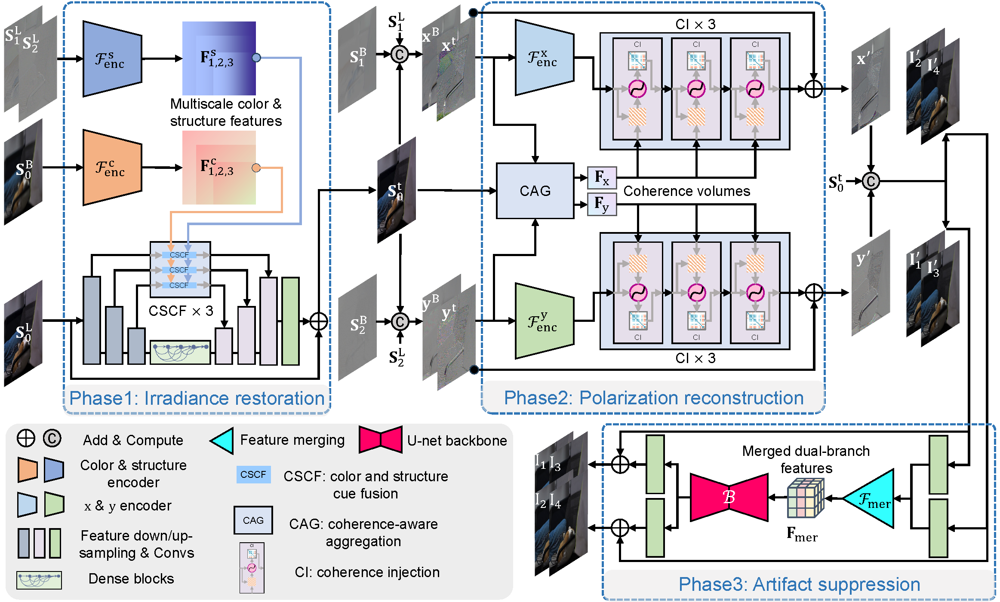

# Quality-Improved and Property-Preserved Polarimetric Imaging via Complementarily Fusing

By [Chu Zhou](https://fourson.github.io/), Yixing Liu, Chao Xu, [Boxin Shi](http://ci.idm.pku.edu.cn/)


[PDF]() | [SUPP]()

## Abstract
Polarimetric imaging is a challenging problem in the field of polarization-based vision, since setting a short exposure time reduces the signal-to-noise ratio, making the degree of polarization (DoP) and the angle of polarization (AoP) severely degenerated, while if setting a relatively long exposure time, the DoP and AoP would tend to be over-smoothed due to the frequently-occurring motion blur. This work proposes a polarimetric imaging framework that can produce clean and clear polarized snapshots by complementarily fusing a degraded pair of noisy and blurry ones. By adopting a neural network-based three-phase fusing scheme with specially-designed modules tailored to each phase, our framework can not only improve the image quality but also preserve the polarization properties. Experimental results show that our framework achieves state-of-the-art performance.
## Prerequisites
* Linux Distributions (tested on Ubuntu 22.04).
* NVIDIA GPU and CUDA cuDNN
* Python >= 3.8
* Pytorch >= 2.2.0
* cv2
* numpy
* tqdm
* tensorboardX (for training visualization)

## Pre-trained models
* We provide the [pre-trained models](https://drive.google.com/file/d/162c3LqijhCOBs9t_bpTYzr5wj7LkW_cs/view?usp=sharing) for inference
* Please put the downloaded files (`full.pth`) into the `checkpoint` folder

## Inference
```
python execute/infer_full.py -r checkpoint/full.pth --data_dir <path_to_input_data> --result_dir <path_to_result_data> --data_loader_type WithoutGroundTruthDataLoader default
```

## Visualization
Since the file format we use is `.npy`, we provide scrips for visualization:
* use `notebooks/visualize_aop.py` to visualize the AoP
* use `notebooks/visualize_dop.py` to visualize the DoP
* use `notebooks/visualize_S0.py` to visualize S0

## How to make the dataset
* First, please follow the guidance of the [PLIE dataset](https://github.com/fourson/Polarization-Aware-Low-Light-Image-Enhancement/tree/master) to preprocess the raw images
  * Until you obtain two folders named as `raw_images/data_train_temp` and `raw_images/data_test_temp` respectively
* Then, run `python scripts/make_dataset_for_train.py` and `python scripts/make_dataset_for_test.py` respectively
  * After that, run `python scripts/compute_DoP_AoP_S0_for_test.py`
* Finally, you should obtain all the data for training and testing
  
## Training your own model
* First, train Phase1 (Irradiance restoration) and Phase2 (Polarization reconstruction) independently:
  * run `python execute/train.py -c config/phase1.json` and `python execute/train.py -c config/phase2.json`
* Then, train the entire network in an end-to-end manner:
  * run `python execute/train.py -c config/full.json --phase1_checkpoint_path <path_to_phase1_checkpoint> --phase2_checkpoint_path <path_to_phase2_checkpoint>
  `

Note that all config files (`config/*.json`) and the learning rate schedule function (MultiplicativeLR) at `get_lr_lambda` in `utils/util.py` could be edited

## About the metrics
* To align with previous works, we compute PSNR/SSIM following these steps:
  * For S0 (in the range of [0, 2])
    * Divide it by 2 to normalize its values to [0, 1]
    * Compute PSNR/SSIM
  * For DoP (in the range of [0, 1])
    * Average three color channels into a single average channel
    * Copy the average channel back to three channel
    * Compute PSNR/SSIM
  * For AoP (in the range of [0, pi])
    * Divide it by pi to normalize its values to [0, 1]
    * Average three color channels into a single average channel
    * Copy the average channel back to three channel
    * Compute PSNR/SSIM

## Citation
If you find this work helpful to your research, please cite:
```
coming soon
```
